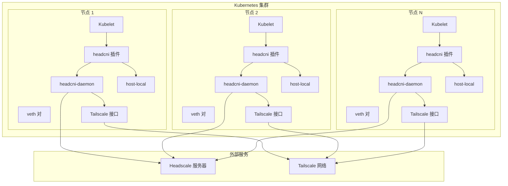
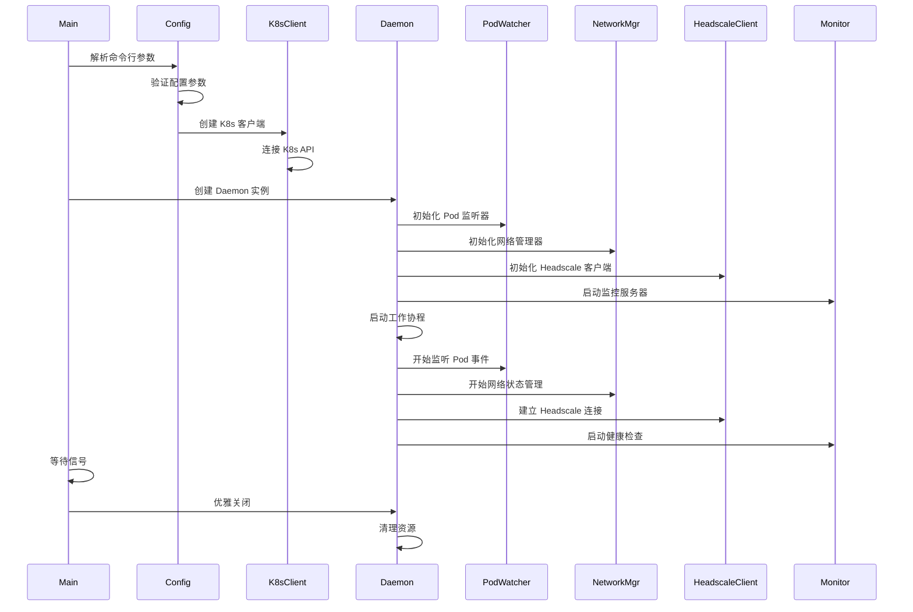
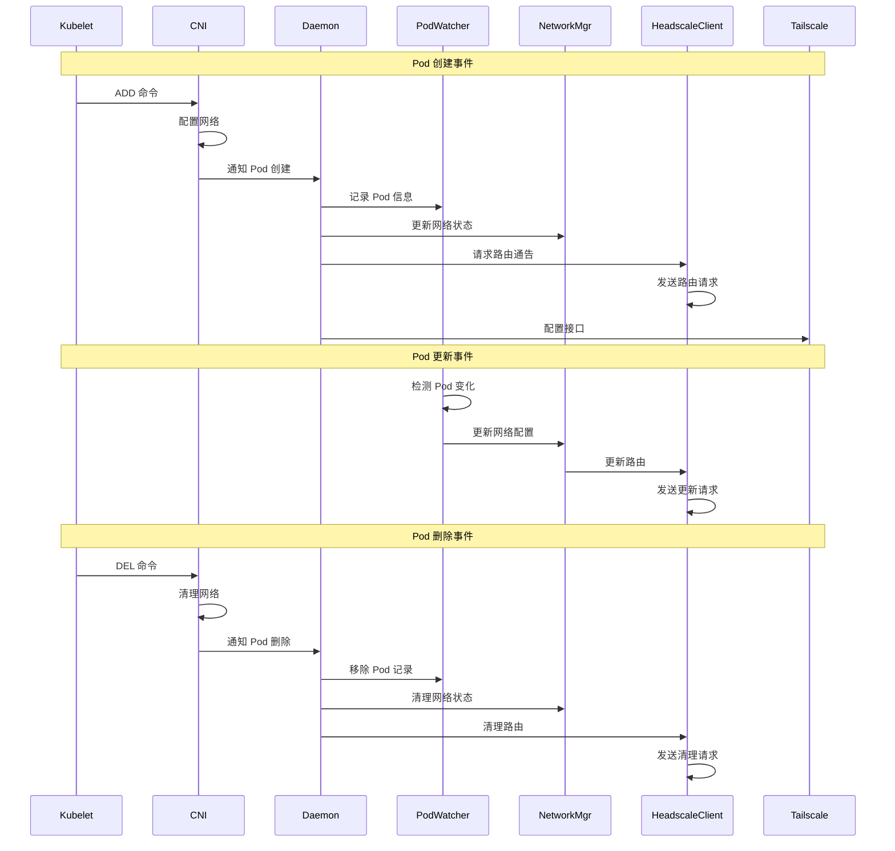
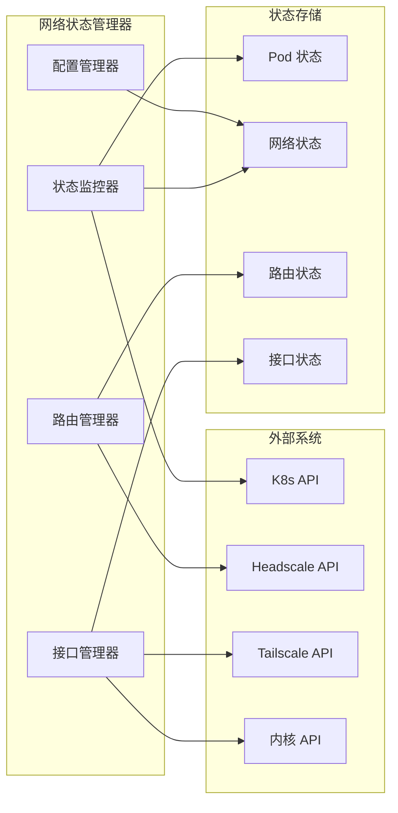

# HeadCNI 运行架构图

## 🏗️ 整体运行架构



## 🔄 守护进程运行架构

```mermaid
graph TB
    subgraph "headcni-daemon 进程"
        subgraph "初始化层"
            Main[main() 函数]
            Config[配置解析]
            K8sClient[K8s 客户端]
            Logger[日志系统]
        end
        
        subgraph "核心组件"
            Daemon[Daemon 实例]
            PodWatcher[Pod 监听器]
            NetworkMgr[网络管理器]
            HeadscaleClient[Headscale 客户端]
            Monitor[监控服务器]
        end
        
        subgraph "工作协程"
            PodProcessor[Pod 处理器]
            NetworkStateMgr[网络状态管理器]
            HeadscaleConnector[Headscale 连接器]
            TailscaleInterfaceMgr[Tailscale 接口管理器]
        end
        
        subgraph "事件处理"
            PodEventHandler[Pod 事件处理器]
            NetworkEventHandler[网络事件处理器]
            ErrorHandler[错误处理器]
        end
    end
    
    subgraph "外部依赖"
        K8sAPI[Kubernetes API]
        HeadscaleAPI[Headscale API]
        TailscaleAPI[Tailscale API]
        MetricsEndpoint[监控端点]
    end
    
    Main --> Config
    Config --> K8sClient
    Config --> Logger
    Config --> Daemon
    
    Daemon --> PodWatcher
    Daemon --> NetworkMgr
    Daemon --> HeadscaleClient
    Daemon --> Monitor
    
    PodWatcher --> PodProcessor
    NetworkMgr --> NetworkStateMgr
    HeadscaleClient --> HeadscaleConnector
    Monitor --> MetricsEndpoint
    
    PodProcessor --> PodEventHandler
    NetworkStateMgr --> NetworkEventHandler
    HeadscaleConnector --> HeadscaleAPI
    TailscaleInterfaceMgr --> TailscaleAPI
    
    K8sClient --> K8sAPI
    PodEventHandler --> ErrorHandler
    NetworkEventHandler --> ErrorHandler
```

## 📊 详细运行流程

### 1. **守护进程启动流程**



### 2. **Pod 生命周期管理**



### 3. **网络状态管理**



## 🔧 组件详细功能

### 1. **Daemon 核心组件**

#### **PodWatcher (Pod 监听器)**
```go
type PodWatcher struct {
    client    kubernetes.Interface
    informer  cache.SharedIndexInformer
    workqueue workqueue.RateLimitingInterface
    handler   PodEventHandler
}

// 主要功能：
// - 监听 Pod 创建/更新/删除事件
// - 过滤相关 Pod (根据标签选择器)
// - 将事件加入工作队列
// - 触发事件处理器
```

#### **NetworkManager (网络管理器)**
```go
type NetworkManager struct {
    config     *Config
    state      *NetworkState
    routes     map[string]*RouteInfo
    interfaces map[string]*InterfaceInfo
}

// 主要功能：
// - 管理网络接口状态
// - 维护路由表信息
// - 处理网络配置变更
// - 监控网络连接状态
```

#### **HeadscaleClient (Headscale 客户端)**
```go
type HeadscaleClient struct {
    baseURL    string
    httpClient *http.Client
    authKey    string
}

// 主要功能：
// - 连接 Headscale API
// - 请求路由通告
// - 管理路由策略
// - 处理认证和授权
```

### 2. **工作协程**

#### **PodProcessor (Pod 处理器)**
```go
// 主要职责：
// - 处理 Pod 生命周期事件
// - 更新网络配置
// - 同步状态信息
// - 错误重试机制
```

#### **NetworkStateManager (网络状态管理器)**
```go
// 主要职责：
// - 维护网络状态一致性
// - 处理网络配置变更
// - 监控网络健康状态
// - 故障检测和恢复
```

#### **HeadscaleConnector (Headscale 连接器)**
```go
// 主要职责：
// - 维护与 Headscale 的连接
// - 处理 API 请求和响应
// - 实现重连机制
// - 错误处理和重试
```

### 3. **事件处理系统**

#### **PodEventHandler (Pod 事件处理器)**
```go
func (h *PodEventHandler) OnAdd(obj interface{}) {
    // 处理 Pod 创建事件
    // - 解析 Pod 信息
    // - 配置网络接口
    // - 更新路由表
    // - 通知其他组件
}

func (h *PodEventHandler) OnUpdate(oldObj, newObj interface{}) {
    // 处理 Pod 更新事件
    // - 检测配置变更
    // - 更新网络配置
    // - 同步状态信息
}

func (h *PodEventHandler) OnDelete(obj interface{}) {
    // 处理 Pod 删除事件
    // - 清理网络接口
    // - 移除路由配置
    // - 释放资源
}
```

## 📈 监控和指标

### **Prometheus 指标**
```go
// 主要指标：
var (
    podNetworkSetupDuration = prometheus.NewHistogramVec(
        prometheus.HistogramOpts{
            Name: "headcni_pod_network_setup_duration_seconds",
            Help: "Pod network setup duration in seconds",
        },
        []string{"namespace", "pod_name"},
    )
    
    ipAllocationsTotal = prometheus.NewCounterVec(
        prometheus.CounterOpts{
            Name: "headcni_ip_allocations_total",
            Help: "Total number of IP allocations",
        },
        []string{"strategy"},
    )
    
    networkErrorsTotal = prometheus.NewCounterVec(
        prometheus.CounterOpts{
            Name: "headcni_network_errors_total",
            Help: "Total number of network errors",
        },
        []string{"error_type"},
    )
)
```

### **健康检查端点**
```go
// 健康检查路径：
// - /healthz: 基本健康检查
// - /ready: 就绪状态检查
// - /metrics: Prometheus 指标
// - /debug/pprof: 性能分析
```

## 🔄 运行模式

### **Host 模式**
```go
// Host 模式特点：
// - 使用现有的主机 Tailscale 接口
// - 守护进程监控 Pod 变化
// - 动态创建和删除路由规则
// - 与主机 Tailscale 进程协作
```

### **Daemon 模式**
```go
// Daemon 模式特点：
// - 管理专用的 Tailscale 接口
// - 完全控制网络配置
// - 独立的网络命名空间
// - 更精细的网络控制
```

## 🛠️ 故障处理

### **错误恢复机制**
```go
// 主要恢复策略：
// - 网络接口故障重试
// - Headscale 连接重连
// - Pod 事件重处理
// - 状态不一致修复
// - 资源清理和重建
```

### **日志和调试**
```go
// 日志级别：
// - DEBUG: 详细调试信息
// - INFO: 一般信息
// - WARN: 警告信息
// - ERROR: 错误信息
// - FATAL: 致命错误
``` 