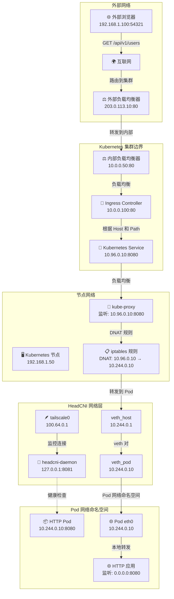
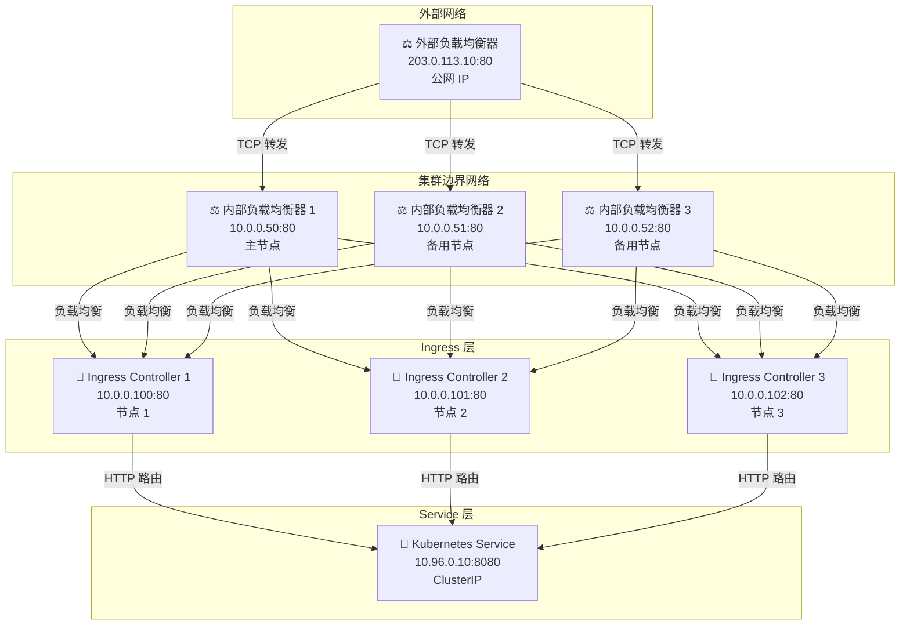
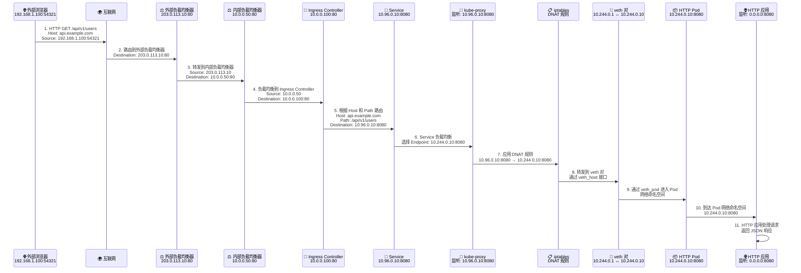

# 外部浏览器访问 HTTP Pod 服务流量全走向图 - 详细技术版

## 🌐 整体流量架构概览

### 1. **外部浏览器到 Pod 服务的完整流量路径**



## 🔧 内部负载均衡器详解

### 2. **内部负载均衡器架构**



### 3. **内部负载均衡器配置**

```bash
# 内部负载均衡器配置示例 (HAProxy)
global
    daemon
    maxconn 4096

defaults
    mode tcp
    timeout connect 5000ms
    timeout client 50000ms
    timeout server 50000ms

frontend kubernetes-internal-frontend
    bind 10.0.0.50:80
    mode tcp
    default_backend ingress-controllers-backend

backend ingress-controllers-backend
    mode tcp
    balance roundrobin
    server ingress-1 10.0.0.100:80 check
    server ingress-2 10.0.0.101:80 check
    server ingress-3 10.0.0.102:80 check

# 健康检查配置
option httpchk GET /healthz
http-check expect status 200

# 统计页面
listen stats
    bind 10.0.0.50:8080
    mode http
    stats enable
    stats uri /stats
    stats refresh 30s
    stats auth admin:password
```

### 4. **内部负载均衡器高可用配置**

```bash
# Keepalived 配置 (VRRP)
vrrp_instance VI_1 {
    state MASTER
    interface eth0
    virtual_router_id 51
    priority 100
    advert_int 1
    authentication {
        auth_type PASS
        auth_pass 1111
    }
    virtual_ipaddress {
        10.0.0.50/24
    }
}

# 主节点配置
vrrp_instance VI_1 {
    state MASTER
    priority 100
}

# 备用节点配置
vrrp_instance VI_1 {
    state BACKUP
    priority 90
}

# 内部负载均衡器监控脚本
#!/bin/bash
# 检查 Ingress Controller 健康状态
check_ingress_health() {
    for ingress in 10.0.0.100:80 10.0.0.101:80 10.0.0.102:80; do
        if ! curl -f -s http://$ingress/healthz > /dev/null; then
            echo "Ingress $ingress is down"
            return 1
        fi
    done
    return 0
}

# 定期健康检查
while true; do
    if ! check_ingress_health; then
        # 触发故障转移
        systemctl restart haproxy
    fi
    sleep 30
done
```

### 5. **内部负载均衡器流量分发策略**

```bash
# HAProxy 负载均衡算法配置
backend ingress-controllers-backend
    mode tcp
    balance roundrobin          # 轮询
    # balance leastconn         # 最少连接
    # balance source            # 源 IP 哈希
    # balance random            # 随机
    
    # 权重配置
    server ingress-1 10.0.0.100:80 weight 100 check
    server ingress-2 10.0.0.101:80 weight 100 check
    server ingress-3 10.0.0.102:80 weight 100 check
    
    # 健康检查配置
    option httpchk GET /healthz
    http-check expect status 200
    default-server inter 3s fall 3 rise 2
    
    # 会话保持
    stick-table type ip size 200k expire 30m
    stick on src
    stick match src
```

### 6. **内部负载均衡器监控和日志**

```bash
# HAProxy 统计页面配置
listen stats
    bind 10.0.0.50:8080
    mode http
    stats enable
    stats uri /stats
    stats refresh 30s
    stats auth admin:password

# 日志配置
global
    log 127.0.0.1 local0
    log 127.0.0.1 local1 notice

defaults
    log global
    mode tcp
    option tcplog
    option dontlognull
    timeout connect 5000ms
    timeout client 50000ms
    timeout server 50000ms

# 日志格式
log-format "%ci:%cp [%tr] %ft %b/%s %TR/%Tw/%Tc/%Tr/%Ta %ST %B %CC %CS %tsc %ac/%fc/%bc/%sc/%rc %sq/%bq %sslc %sslv %{+Q}r"
```

### 7. **内部负载均衡器故障排查**

```bash
# 检查内部负载均衡器状态
systemctl status haproxy
systemctl status keepalived

# 检查网络连通性
ping 10.0.0.50
telnet 10.0.0.50 80

# 检查 HAProxy 统计页面
curl -s http://10.0.0.50:8080/stats | grep -E "(ingress-1|ingress-2|ingress-3)"

# 检查 Ingress Controller 健康状态
curl -f http://10.0.0.100/healthz
curl -f http://10.0.0.101/healthz
curl -f http://10.0.0.102/healthz

# 查看 HAProxy 日志
tail -f /var/log/haproxy.log
journalctl -u haproxy -f

# 查看 Keepalived 日志
journalctl -u keepalived -f

# 检查 VRRP 状态
ip addr show eth0 | grep 10.0.0.50
```

### 8. **内部负载均衡器性能优化**

```bash
# HAProxy 性能优化配置
global
    maxconn 50000
    nbproc 4
    nbthread 4
    cpu-map auto:1/1-4 0-3

defaults
    mode tcp
    option tcplog
    option dontlognull
    timeout connect 5000ms
    timeout client 50000ms
    timeout server 50000ms
    maxconn 10000

# 系统优化
echo 1 > /proc/sys/net/ipv4/tcp_tw_reuse
echo 1 > /proc/sys/net/ipv4/tcp_tw_recycle
echo 65536 > /proc/sys/net/core/somaxconn
echo 65536 > /proc/sys/net/ipv4/tcp_max_syn_backlog
```

## 🔄 详细流量路径分析

### 9. **请求流量路径 (Request Flow) - 详细版**



## 🔧 网络配置详解

### 10. **外部负载均衡器配置详解**

```bash
# 外部负载均衡器配置示例 (HAProxy)
global
    daemon
    maxconn 4096

defaults
    mode tcp
    timeout connect 5000ms
    timeout client 50000ms
    timeout server 50000ms

frontend kubernetes-external-frontend
    bind 203.0.113.10:80
    mode tcp
    default_backend kubernetes-internal-backend

backend kubernetes-internal-backend
    mode tcp
    balance roundrobin
    server internal-lb-1 10.0.0.50:80 check
    server internal-lb-2 10.0.0.51:80 check
    server internal-lb-3 10.0.0.52:80 check

# 外部负载均衡器转发规则
# 外部请求 203.0.113.10:80 → 内部负载均衡器 10.0.0.50:80
```

### 11. **Ingress Controller 配置详解**

```yaml
# Ingress 资源配置
apiVersion: networking.k8s.io/v1
kind: Ingress
metadata:
  name: api-ingress
  namespace: default
  annotations:
    nginx.ingress.kubernetes.io/rewrite-target: /
spec:
  rules:
  - host: api.example.com
    http:
      paths:
      - path: /api/v1
        pathType: Prefix
        backend:
          service:
            name: api-service
            port:
              number: 8080

# Ingress Controller 转发逻辑
# 1. 接收请求: 10.0.0.100:80
# 2. 解析 Host 头: api.example.com
# 3. 匹配 Path: /api/v1
# 4. 转发到 Service: api-service:8080
```

### 12. **Service 路由配置详解**

```yaml
# Service 配置
apiVersion: v1
kind: Service
metadata:
  name: api-service
  namespace: default
spec:
  type: ClusterIP
  clusterIP: 10.96.0.10
  ports:
  - port: 8080
    targetPort: 8080
    protocol: TCP
    name: http
  selector:
    app: api-server

# Endpoints 配置
apiVersion: v1
kind: Endpoints
metadata:
  name: api-service
  namespace: default
subsets:
- addresses:
  - ip: 10.244.0.10
    nodeName: node-1
  - ip: 10.244.0.11
    nodeName: node-2
  ports:
  - port: 8080
    protocol: TCP
    name: http

# Service 路由逻辑
# 1. 接收请求: 10.96.0.10:8080
# 2. 负载均衡选择 Endpoint
# 3. 转发到 Pod: 10.244.0.10:8080 或 10.244.0.11:8080
```

### 13. **kube-proxy iptables 规则详解**

```bash
# 查看 Service 相关的 iptables 规则
iptables -t nat -L KUBE-SERVICES -n -v

# 示例规则链结构
Chain KUBE-SERVICES (2 references)
target     prot opt source               destination         
KUBE-SVC-XXXXX  tcp  --  0.0.0.0/0            10.96.0.10           tcp dpt:8080

Chain KUBE-SVC-XXXXX (1 references)
target     prot opt source               destination         
KUBE-SEP-XXXXX1  tcp  --  0.0.0.0/0            0.0.0.0/0            tcp dpt:8080 statistic mode random probability 0.50000000000
KUBE-SEP-XXXXX2  tcp  --  0.0.0.0/0            0.0.0.0/0            tcp dpt:8080

Chain KUBE-SEP-XXXXX1 (1 references)
target     prot opt source               destination         
KUBE-MARK-MASQ  tcp  --  10.244.0.10          0.0.0.0/0            tcp dpt:8080
DNAT       tcp  --  0.0.0.0/0            0.0.0.0/0            tcp dpt:8080 to:10.244.0.10:8080

# iptables 转发流程
# 1. KUBE-SERVICES: 匹配目标 Service IP 10.96.0.10:8080
# 2. KUBE-SVC-XXXXX: 负载均衡选择 Endpoint
# 3. KUBE-SEP-XXXXX1: DNAT 到 Pod IP 10.244.0.10:8080
# 4. KUBE-MARK-MASQ: 标记需要 SNAT 的包
```

### 14. **HeadCNI veth 对配置详解**

```bash
# 查看 veth 对配置
ip link show veth_host
# 输出示例:
# 12: veth_host@veth_pod: <BROADCAST,MULTICAST,UP,LOWER_UP> mtu 1500 qdisc noqueue state UP mode DEFAULT group default qlen 1000
#     link/ether 02:42:ac:11:00:01 brd ff:ff:ff:ff:ff:ff

ip addr show veth_host
# 输出示例:
# 12: veth_host@veth_pod: <BROADCAST,MULTICAST,UP,LOWER_UP> mtu 1500 qdisc noqueue state UP group default qlen 1000
#     link/ether 02:42:ac:11:00:01 brd ff:ff:ff:ff:ff:ff
#     inet 10.244.0.1/24 scope global veth_host
#        valid_lft forever preferred_lft forever

# 查看 Pod 网络命名空间配置
ip netns exec <pod-namespace> ip addr show
# 输出示例:
# 2: eth0@if13: <BROADCAST,MULTICAST,UP,LOWER_UP> mtu 1500 qdisc noqueue state UP group default qlen 1000
#     link/ether 02:42:ac:11:00:02 brd ff:ff:ff:ff:ff:ff link-netnsid 0
#     inet 10.244.0.10/24 scope global eth0
#        valid_lft forever preferred_lft forever

# veth 对转发机制
# 1. 主机网络命名空间: veth_host (10.244.0.1/24)
# 2. Pod 网络命名空间: veth_pod → eth0 (10.244.0.10/24)
# 3. 数据包通过 veth 对直接转发
```

### 15. **Tailscale Overlay 网络配置详解**

```bash
# 查看 Tailscale 接口配置
ip addr show tailscale0
# 输出示例:
# 14: tailscale0: <POINTOPOINT,MULTICAST,NOARP,UP,LOWER_UP> mtu 1280 qdisc noqueue state UNKNOWN group default qlen 500
#     link/none 
#     inet 100.64.0.1/10 scope global tailscale0
#        valid_lft forever preferred_lft forever

# 查看 Tailscale 路由表
ip route show table all | grep tailscale
# 输出示例:
# 100.64.0.0/10 dev tailscale0 scope link
# 100.64.0.1 dev tailscale0 scope link

# HeadCNI 配置文件
cat /etc/headcni/config.yaml
# 输出示例:
# apiVersion: v1
# kind: Config
# metadata:
#   name: headcni-config
# spec:
#   headscale:
#     url: "https://headscale.example.com"
#     apiKey: "hs_xxxxxxxxxxxxxxxxxxxxxxxxxxxxxxxx"
#   network:
#     cidr: "10.244.0.0/24"
#     gateway: "10.244.0.1"
#   tailscale:
#     interface: "tailscale0"
#     mtu: 1280

# Tailscale Overlay 网络转发机制
# 1. Pod 到 Pod 跨节点通信通过 Tailscale 接口
# 2. 节点间建立 WireGuard 隧道
# 3. 数据包通过 100.64.0.0/10 网段路由
```

## 🔍 详细技术实现

### 16. **流量转发机制详解**

#### **外部负载均衡器到内部负载均衡器的转发**

```bash
# 外部负载均衡器监听配置
netstat -tlnp | grep :80
# 输出示例:
# tcp        0      0 203.0.113.10:80        0.0.0.0:*               LISTEN      1234/haproxy

# 外部负载均衡器转发规则
iptables -t nat -L -n | grep 203.0.113.10
# 输出示例:
# DNAT       tcp  --  0.0.0.0/0            203.0.113.10          tcp dpt:80 to:10.0.0.50:80

# 实际转发过程
# 1. 外部请求到达 203.0.113.10:80
# 2. HAProxy 根据配置选择后端内部负载均衡器
# 3. 转发到 10.0.0.50:80 (内部负载均衡器)
```

#### **内部负载均衡器到 Ingress 的转发**

```bash
# 内部负载均衡器监听配置
netstat -tlnp | grep :80
# 输出示例:
# tcp        0      0 10.0.0.50:80          0.0.0.0:*               LISTEN      5678/haproxy

# 内部负载均衡器转发规则
iptables -t nat -L -n | grep 10.0.0.50
# 输出示例:
# DNAT       tcp  --  0.0.0.0/0            10.0.0.50             tcp dpt:80 to:10.0.0.100:80

# 实际转发过程
# 1. 内部请求到达 10.0.0.50:80
# 2. HAProxy 根据负载均衡算法选择 Ingress Controller
# 3. 转发到 10.0.0.100:80 (Ingress Controller)
```

#### **Ingress 到 Service 的路由**

```bash
# Ingress Controller 配置
kubectl get ingress api-ingress -o yaml
# 输出示例:
# spec:
#   rules:
#   - host: api.example.com
#     http:
#       paths:
#       - path: /api/v1
#         pathType: Prefix
#         backend:
#           service:
#             name: api-service
#             port:
#               number: 8080

# Ingress Controller 路由逻辑
# 1. 接收 HTTP 请求
# 2. 解析 Host 头: api.example.com
# 3. 匹配 Path: /api/v1
# 4. 查找对应的 Service: api-service
# 5. 转发到 Service IP: 10.96.0.10:8080
```

#### **Service 到 Pod 的负载均衡**

```bash
# Service 配置
kubectl get svc api-service -o yaml
# 输出示例:
# spec:
#   clusterIP: 10.96.0.10
#   ports:
#   - port: 8080
#     targetPort: 8080
#     protocol: TCP

# Endpoints 配置
kubectl get endpoints api-service -o yaml
# 输出示例:
# subsets:
# - addresses:
#   - ip: 10.244.0.10
#     nodeName: node-1
#   - ip: 10.244.0.11
#     nodeName: node-2
#   ports:
#   - port: 8080
#     protocol: TCP

# kube-proxy 负载均衡算法
# 1. 轮询 (Round Robin)
# 2. 最少连接 (Least Connections)
# 3. 随机 (Random)
# 4. 源 IP 哈希 (Source IP Hash)
```

#### **iptables DNAT 规则详解**

```bash
# 查看完整的 iptables 规则链
iptables -t nat -L -n -v --line-numbers

# 规则链执行顺序
# 1. PREROUTING 链
# 2. INPUT 链
# 3. FORWARD 链
# 4. OUTPUT 链
# 5. POSTROUTING 链

# Service 相关的规则链
Chain PREROUTING (policy ACCEPT 0 packets, 0 bytes)
num   pkts bytes target     prot opt in     out     source               destination         
1        0     0 KUBE-SERVICES  all  --  *      *       0.0.0.0/0            0.0.0.0/0            /* kubernetes service portals */

Chain KUBE-SERVICES (2 references)
num   pkts bytes target     prot opt in     out     source               destination         
1        0     0 KUBE-SVC-XXXXX  tcp  --  *      *       0.0.0.0/0            10.96.0.10           tcp dpt:8080

Chain KUBE-SVC-XXXXX (1 references)
num   pkts bytes target     prot opt in     out     source               destination         
1        0     0 KUBE-SEP-XXXXX1  tcp  --  *      *       0.0.0.0/0            0.0.0.0/0            tcp dpt:8080 statistic mode random probability 0.50000000000
2        0     0 KUBE-SEP-XXXXX2  tcp  --  *      *       0.0.0.0/0            0.0.0.0/0            tcp dpt:8080

Chain KUBE-SEP-XXXXX1 (1 references)
num   pkts bytes target     prot opt in     out     source               destination         
1        0     0 KUBE-MARK-MASQ  tcp  --  *      *       10.244.0.10          0.0.0.0/0            tcp dpt:8080
2        0     0 DNAT       tcp  --  *      *       0.0.0.0/0            0.0.0.0/0            tcp dpt:8080 to:10.244.0.10:8080

# DNAT 规则执行过程
# 1. 数据包到达 PREROUTING 链
# 2. 匹配 KUBE-SERVICES 规则
# 3. 跳转到 KUBE-SVC-XXXXX 链
# 4. 根据负载均衡算法选择 KUBE-SEP-XXXXX1 或 KUBE-SEP-XXXXX2
# 5. 执行 DNAT 规则，修改目标地址为 Pod IP
```

#### **veth 对转发机制详解**

```bash
# veth 对创建过程
ip link add veth_host type veth peer name veth_pod
ip link set veth_host up
ip link set veth_pod up

# 配置 IP 地址
ip addr add 10.244.0.1/24 dev veth_host

# 将 veth_pod 移动到 Pod 网络命名空间
ip link set veth_pod netns <pod-namespace>
ip netns exec <pod-namespace> ip addr add 10.244.0.10/24 dev veth_pod
ip netns exec <pod-namespace> ip link set veth_pod up

# 配置路由
ip netns exec <pod-namespace> ip route add default via 10.244.0.1 dev veth_pod

# veth 对转发原理
# 1. veth 对是 Linux 内核的虚拟网络接口对
# 2. 发送到 veth_host 的数据包会直接出现在 veth_pod
# 3. 发送到 veth_pod 的数据包会直接出现在 veth_host
# 4. 无需额外的路由或转发规则
```

#### **Tailscale Overlay 网络详解**

```bash
# Tailscale 接口配置
tailscale status
# 输出示例:
# 100.64.0.1    node-1.example.com    linux   -
# 100.64.0.2    node-2.example.com    linux   -

# WireGuard 隧道配置
ip link show tailscale0
# 输出示例:
# 14: tailscale0: <POINTOPOINT,MULTICAST,NOARP,UP,LOWER_UP> mtu 1280 qdisc noqueue state UNKNOWN group default qlen 500
#     link/none

# 路由表配置
ip route show table all | grep 100.64
# 输出示例:
# 100.64.0.0/10 dev tailscale0 scope link
# 100.64.0.1 dev tailscale0 scope link
# 100.64.0.2 via 100.64.0.2 dev tailscale0

# HeadCNI 与 Tailscale 集成
# 1. HeadCNI 守护进程监控 Tailscale 接口状态
# 2. 为 Pod 分配 10.244.0.0/24 网段的 IP
# 3. 通过 veth 对连接 Pod 到主机网络
# 4. 跨节点 Pod 通信通过 Tailscale 接口路由
```

## 📊 流量监控与调试

### 17. **详细调试命令示例**

```bash
# 1. 监控外部请求 (外部负载均衡器层面)
tcpdump -i eth0 -n host 203.0.113.10 and port 80 -vvv

# 2. 监控内部负载均衡器流量
tcpdump -i eth0 -n host 10.0.0.50 and port 80 -vvv

# 3. 监控 Ingress 流量
tcpdump -i eth0 -n host 10.0.0.100 and port 80 -vvv

# 4. 监控 Service 流量
tcpdump -i any -n host 10.96.0.10 and port 8080 -vvv

# 5. 监控 iptables 规则命中情况
iptables -t nat -L KUBE-SERVICES -n -v
iptables -t nat -L KUBE-SVC-XXXXX -n -v
iptables -t nat -L KUBE-SEP-XXXXX1 -n -v

# 6. 监控 veth 对流量
tcpdump -i veth_host -n host 10.244.0.10 and port 8080 -vvv

# 7. 监控 Pod 网络命名空间流量
ip netns exec <pod-namespace> tcpdump -i eth0 -n port 8080 -vvv

# 8. 监控 Tailscale 接口流量
tcpdump -i tailscale0 -n -vvv

# 9. 查看内部负载均衡器状态
curl -s http://10.0.0.50:8080/stats | grep -E "(ingress-1|ingress-2|ingress-3)"

# 10. 查看 HeadCNI 守护进程日志
kubectl logs -n kube-system -l app=headcni-daemon -f --tail=100

# 11. 测试 Pod 连通性
kubectl exec -it <pod-name> -- curl -v http://10.96.0.10:8080/api/v1/users

# 12. 查看 Pod 网络配置
kubectl exec -it <pod-name> -- ip addr show
kubectl exec -it <pod-name> -- ip route show

# 13. 查看 Tailscale 连接状态
tailscale status
tailscale ping 100.64.0.1
```

## 🔍 故障排查指南

### 18. **常见问题排查 - 详细版**

| 问题现象 | 排查步骤 | 具体命令 | 解决方案 |
|---------|---------|---------|---------|
| 外部无法访问 Pod | 1. 检查外部负载均衡器状态<br>2. 检查内部负载均衡器状态<br>3. 检查 Ingress 配置<br>4. 检查 Service 状态<br>5. 检查 iptables 规则 | `curl -v 203.0.113.10:80`<br>`curl -v 10.0.0.50:80`<br>`kubectl get ingress`<br>`kubectl get svc`<br>`iptables -t nat -L` | 修复配置或重启组件 |
| 内部负载均衡器故障 | 1. 检查 HAProxy 进程<br>2. 检查 Keepalived 状态<br>3. 检查网络连通性<br>4. 检查健康检查 | `systemctl status haproxy`<br>`systemctl status keepalived`<br>`ping 10.0.0.50`<br>`curl -f http://10.0.0.100/healthz` | 重启服务或切换主备 |
| Pod 网络不通 | 1. 检查 veth 对状态<br>2. 检查 HeadCNI 配置<br>3. 检查 Tailscale 连接<br>4. 检查 Pod 网络命名空间 | `ip link show veth_host`<br>`kubectl logs headcni-daemon`<br>`tailscale status`<br>`ip netns exec <ns> ip addr` | 重启 HeadCNI 或修复网络 |
| Service 无法访问 | 1. 检查 Endpoints<br>2. 检查 kube-proxy<br>3. 检查 iptables 规则<br>4. 检查 Pod 健康状态 | `kubectl get endpoints`<br>`kubectl logs kube-proxy`<br>`iptables -t nat -L KUBE-SERVICES`<br>`kubectl get pods` | 修复 Service 配置 |

### 19. **日志分析 - 详细版**

```bash
# 内部负载均衡器日志
tail -f /var/log/haproxy.log
journalctl -u haproxy -f

# Keepalived 日志
journalctl -u keepalived -f

# HeadCNI 守护进程日志
kubectl logs -n kube-system -l app=headcni-daemon -f --tail=100

# kube-proxy 日志
kubectl logs -n kube-system -l k8s-app=kube-proxy -f --tail=100

# Ingress Controller 日志
kubectl logs -n ingress-nginx -l app.kubernetes.io/name=ingress-nginx -f --tail=100

# HeadCNI IPAM 日志
kubectl logs -n kube-system -l app=headcni-ipam -f --tail=100

# 系统日志
journalctl -u kubelet -f
journalctl -u docker -f

# Tailscale 日志
tailscale status --json
tailscale netcheck
```

---

## 📝 总结

外部浏览器访问 HTTP Pod 服务的完整流量路径包括：

### **详细 IP 地址和端口映射**

1. **外部网络层**: 
   - 浏览器 (192.168.1.100:54321) → 外部负载均衡器 (203.0.113.10:80)

2. **内部负载均衡层**: 
   - 外部负载均衡器 (203.0.113.10:80) → 内部负载均衡器 (10.0.0.50:80)

3. **Ingress 层**: 
   - 内部负载均衡器 (10.0.0.50:80) → Ingress Controller (10.0.0.100:80)

4. **Kubernetes 服务层**: 
   - Ingress Controller (10.0.0.100:80) → Service (10.96.0.10:8080) → Endpoints (10.244.0.10:8080)

5. **节点网络层**: 
   - kube-proxy (监听 10.96.0.10:8080) → iptables (DNAT 规则) → veth_host (10.244.0.1)

6. **HeadCNI 网络层**: 
   - veth 对 (10.244.0.1 ↔ 10.244.0.10) → Tailscale 接口 (100.64.0.1)

7. **Pod 网络层**: 
   - Pod 网络命名空间 (10.244.0.10:8080) → HTTP 应用 (监听 0.0.0.0:8080)

### **关键转发机制**

- **外部负载均衡器**: 基于 HAProxy 的 TCP 转发，公网 IP 到内网 IP
- **内部负载均衡器**: 基于 HAProxy + Keepalived 的高可用负载均衡
- **Ingress**: 基于 Host 和 Path 的 HTTP 路由
- **Service**: 基于 Endpoints 的负载均衡
- **kube-proxy**: 基于 iptables 的 DNAT/SNAT
- **HeadCNI**: 基于 veth 对的网络命名空间隔离
- **Tailscale**: 基于 WireGuard 的 Overlay 网络

### **高可用架构**

- **外部负载均衡器**: 多实例部署，DNS 轮询
- **内部负载均衡器**: 主备模式，VRRP 协议
- **Ingress Controller**: 多实例部署，负载均衡
- **Pod**: 多副本部署，自动扩缩容

HeadCNI 通过精确的 IP 地址分配、veth 对配置和 Tailscale Overlay 网络，结合多层负载均衡器，确保外部流量能够准确、高效、高可用地路由到目标 Pod 服务。 