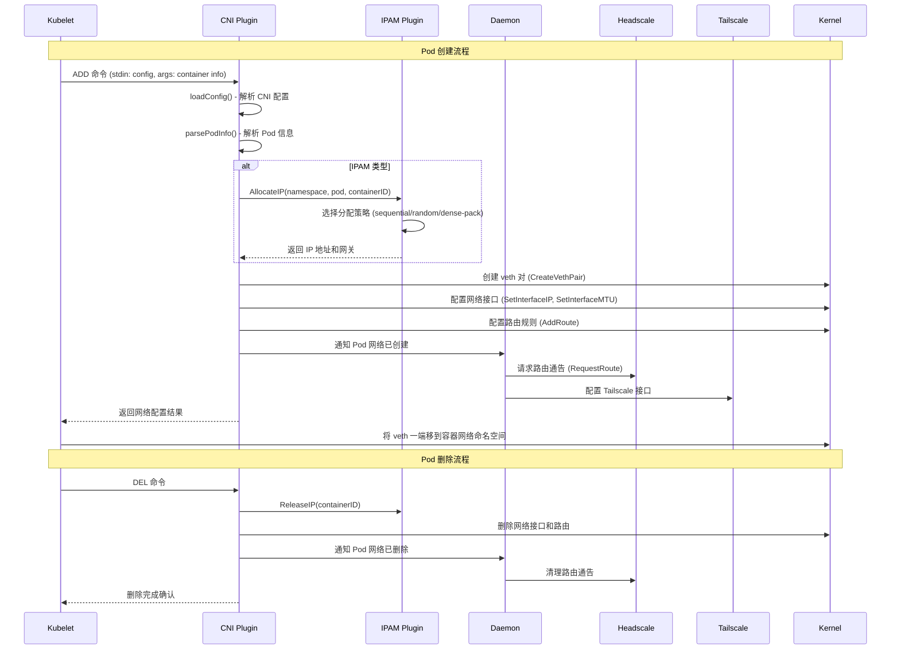
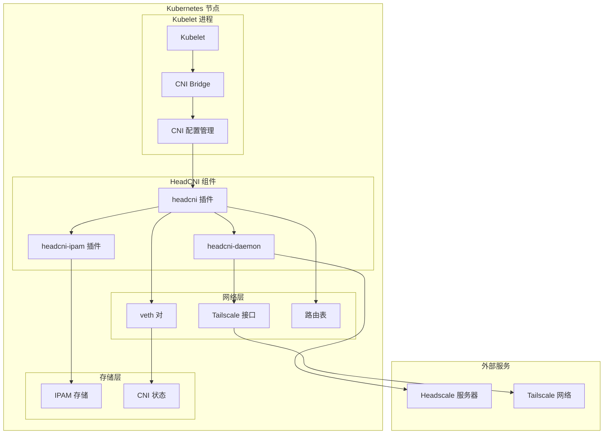
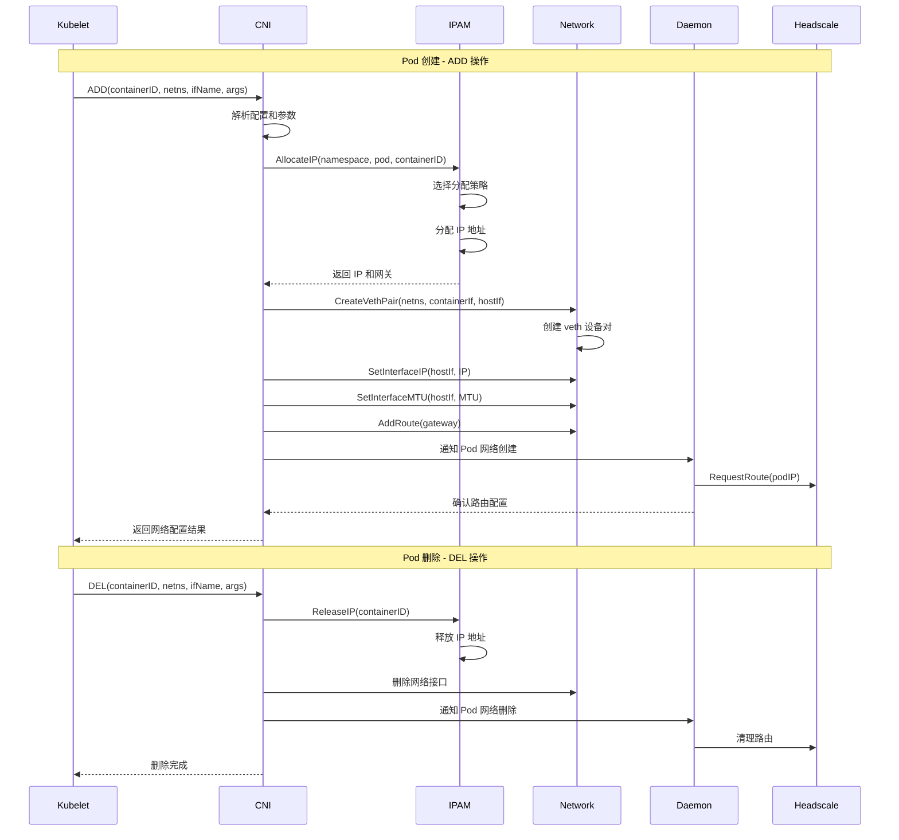
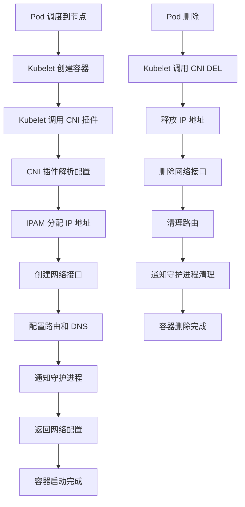
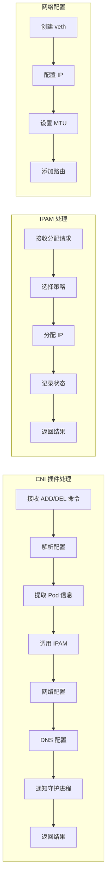
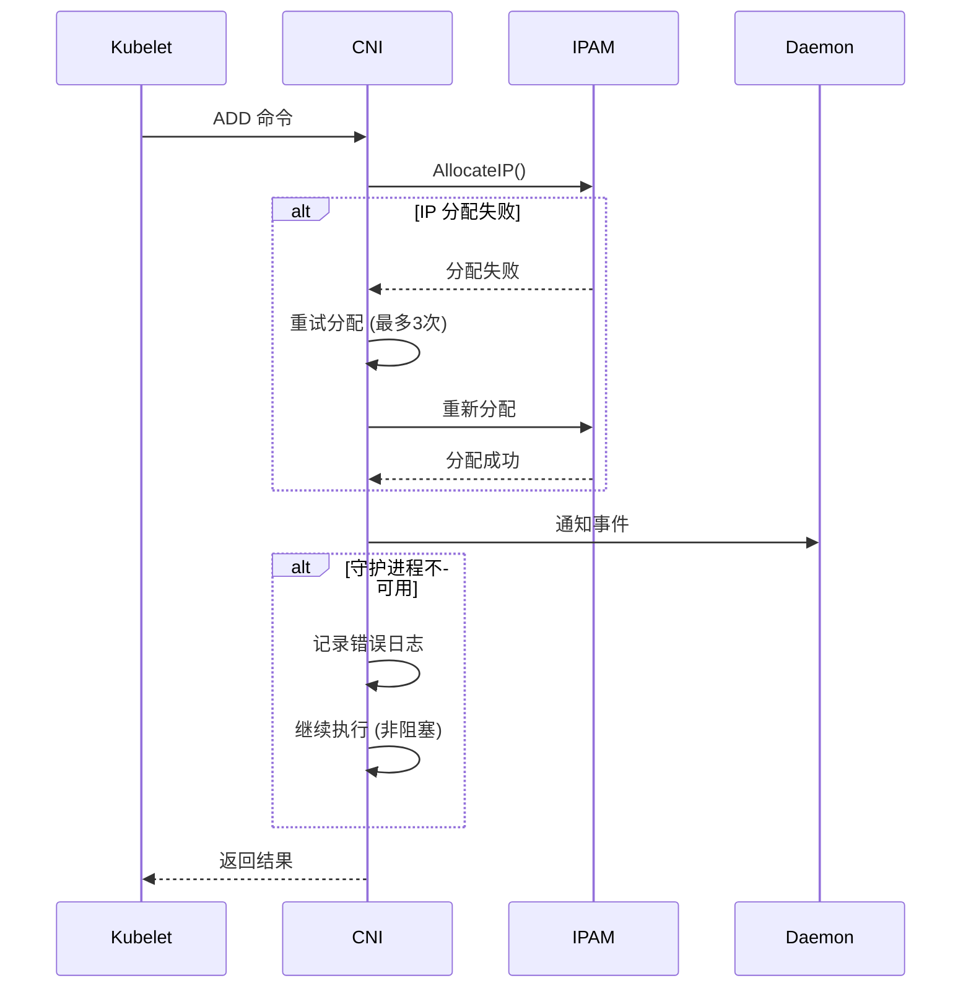

# Kubelet 调用 HeadCNI 架构图

## 🔄 整体调用流程



## 🏗️ 详细组件架构



## 📋 详细功能调用

### 1. **CNI 插件初始化**

```go
// 主要调用链
main() 
  ↓
skel.PluginMain(cmdAdd, cmdCheck, cmdDel, version.All, bv.BuildString("headcni"))
  ↓
loadConfig(args.StdinData, args.Args)
  ↓
parsePodInfo(args.Args)
```

**功能详情：**
- **loadConfig()**: 解析 CNI 配置文件，包括 MagicDNS、IPAM、MTU 等设置
- **parsePodInfo()**: 从 CNI 参数中提取 Pod 命名空间、名称、容器 ID 等信息

### 2. **IPAM 地址分配**

```go
// IPAM 调用链
plugin.ipamManager.AllocateIP(ctx, podInfo.Namespace, podInfo.Name, args.ContainerID)
  ↓
ipam.NewIPAMManager("headcni-daemon", subnet)
  ↓
manager.AllocateIP(ctx, namespace, podName, containerID)
  ↓
manager.selectAllocationStrategy() // sequential/random/dense-pack
  ↓
manager.allocateFromStrategy()
```

**功能详情：**
- **策略选择**: 根据配置选择 IP 分配策略
- **地址分配**: 从可用 IP 池中分配地址
- **状态记录**: 将分配结果记录到本地存储

### 3. **网络接口配置**

```go
// 网络配置调用链
plugin.setupPodNetwork(args, allocation)
  ↓
plugin.networkMgr.CreateVethPair(netnsPath, containerIfName, hostIfName)
  ↓
plugin.networkMgr.SetInterfaceIP(hostIfName, allocation.IP)
  ↓
plugin.networkMgr.SetInterfaceMTU(hostIfName, plugin.config.MTU)
  ↓
plugin.networkMgr.AddRoute(allocation.Gateway)
```

**功能详情：**
- **veth 创建**: 创建虚拟以太网设备对
- **IP 配置**: 为网络接口分配 IP 地址
- **MTU 设置**: 配置最大传输单元
- **路由配置**: 添加网络路由规则

### 4. **DNS 配置**

```go
// DNS 配置调用链
setupDNS(result, plugin.config.MagicDNS)
  ↓
populateDNSConfig(result.DNS, magicDNS)
  ↓
setNameservers(result.DNS, magicDNS.Nameservers)
  ↓
setSearchDomains(result.DNS, magicDNS.SearchDomains)
```

**功能详情：**
- **MagicDNS 启用**: 根据配置启用 MagicDNS
- **DNS 服务器**: 设置 DNS 服务器列表
- **搜索域**: 配置 DNS 搜索域名

### 5. **守护进程交互**

```go
// 守护进程通知
notifyDaemon(podInfo, allocation)
  ↓
sendPodNetworkEvent(event)
  ↓
daemon.handlePodEvent(event)
```

**功能详情：**
- **事件通知**: 向守护进程发送 Pod 网络事件
- **状态同步**: 保持 CNI 插件和守护进程状态一致

## 🔧 CNI 配置文件结构

```json
{
  "cniVersion": "1.0.0",
  "name": "tailscale-cni",
  "type": "headcni",
  
  "headscale_url": "https://hs.binrc.com",
  "tailscale_socket": "/var/run/tailscale/tailscaled.sock",
  
  "pod_cidr": "10.244.0.0/24",
  "service_cidr": "10.96.0.0/16",
  
  "ipam": {
    "type": "host-local",
    "subnet": "10.244.0.0/24",
    "rangeStart": "10.244.0.10",
    "rangeEnd": "10.244.0.254",
    "gateway": "10.244.0.1"
  },
  
  "magic_dns": {
    "enable": true,
    "base_domain": "cluster.local",
    "nameservers": ["10.2.0.1"],
    "search_domains": ["c.binrc.com"]
  },
  
  "mtu": 1280,
  "enable_ipv6": false,
  "enable_network_policy": true
}
```

## 📊 调用时序图



## 🎯 关键功能点

### **CNI 插件核心功能**
1. **配置解析**: 解析 CNI 配置文件和参数
2. **IP 分配**: 通过 IPAM 插件分配 IP 地址
3. **网络配置**: 创建和配置网络接口
4. **路由设置**: 配置网络路由规则
5. **DNS 配置**: 设置 DNS 服务器和搜索域
6. **状态管理**: 维护网络配置状态

### **IPAM 插件功能**
1. **策略管理**: 支持多种 IP 分配策略
2. **地址池管理**: 管理可用 IP 地址池
3. **状态持久化**: 将分配状态保存到本地
4. **冲突检测**: 检测和避免 IP 地址冲突

### **守护进程功能**
1. **事件监听**: 监听 Pod 生命周期事件
2. **路由管理**: 与 Headscale 交互管理路由
3. **状态监控**: 监控网络接口状态
4. **故障恢复**: 处理网络故障和恢复

## 🔍 详细调用分析

### **Kubelet 调用 CNI 的完整流程**



### **CNI 插件内部处理流程**



### **错误处理和重试机制**



## 📈 性能指标

### **关键性能指标**
- **IP 分配时间**: 从请求到分配完成的时间
- **网络配置时间**: veth 创建和配置的时间
- **DNS 配置时间**: DNS 服务器设置的时间
- **错误率**: 各种操作失败的比例
- **资源使用**: 内存和 CPU 使用情况

### **监控点**
- **CNI 插件执行时间**
- **IPAM 分配成功率**
- **网络接口创建成功率**
- **守护进程响应时间**
- **Headscale API 调用延迟**
