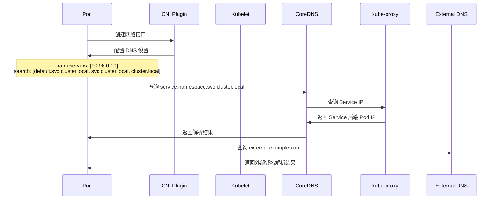
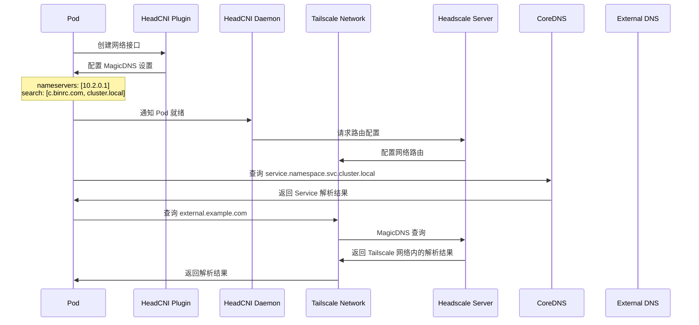
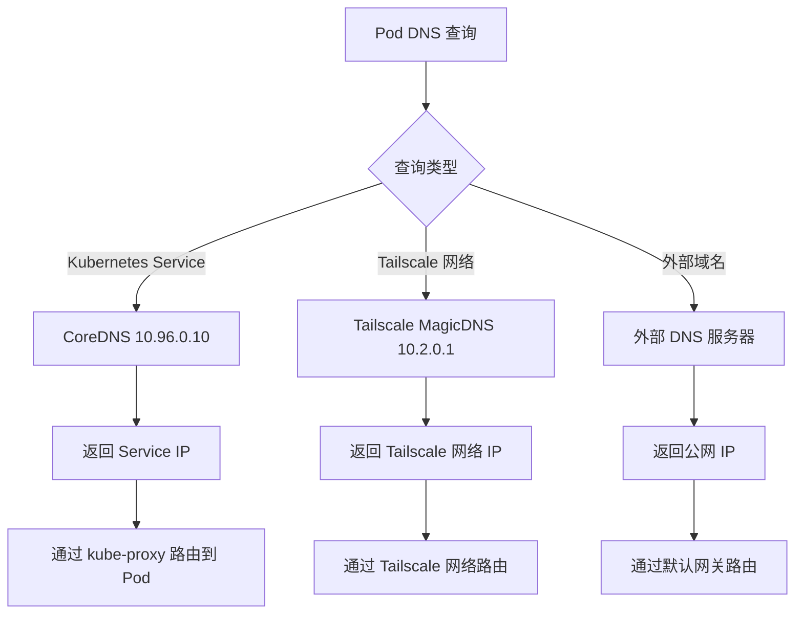
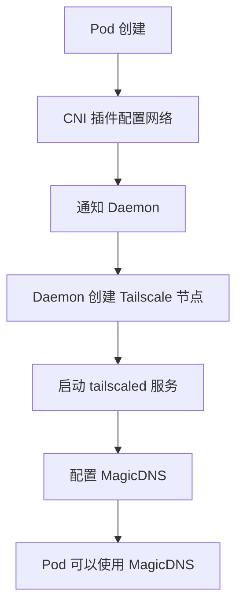
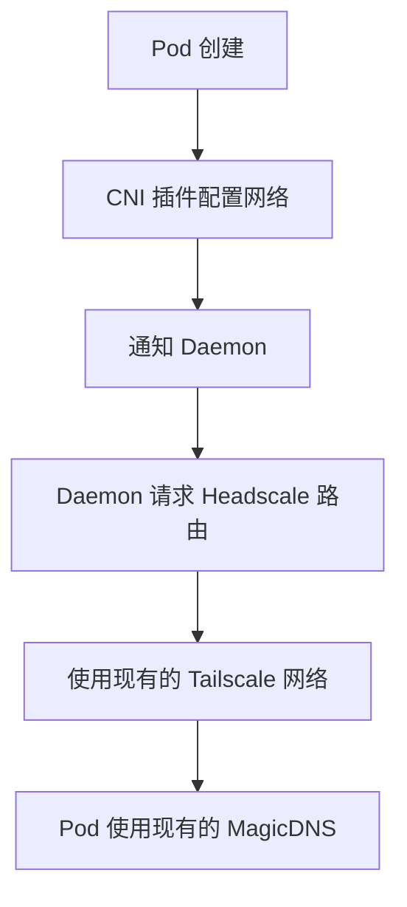

# Pod DNS 解析流程详解

## 概述

在 Kubernetes 集群中，Pod 访问 DNS 服务是一个复杂的过程，涉及多个网络组件和配置。本文档详细描述了 Pod 如何解析 DNS 以及 HeadCNI 在其中扮演的角色。

## 1. DNS 解析的基本流程

### 1.1 传统 CNI 的 DNS 解析



### 1.2 HeadCNI 的 DNS 解析



## 2. DNS 配置详解

### 2.1 HeadCNI 的 DNS 配置

```json
{
  "magic_dns": {
    "enable": true,
    "base_domain": "cluster.local",
    "nameservers": ["10.2.0.1"],
    "search_domains": ["c.binrc.com", "cluster.local"]
  }
}
```

**配置说明：**
- `nameservers: ["10.2.0.1"]` - Tailscale 的 MagicDNS 服务器
- `search_domains: ["c.binrc.com"]` - Tailscale 网络的搜索域
- `search_domains: ["cluster.local"]` - Kubernetes 集群的搜索域

### 2.2 DNS 解析优先级



## 3. 不同场景下的 DNS 解析

### 3.1 集群内 Service 解析

```bash
# Pod 内执行
nslookup nginx-service.default.svc.cluster.local
```

**解析流程：**
1. Pod 查询 `nginx-service.default.svc.cluster.local`
2. 匹配 `search_domains` 中的 `cluster.local`
3. 发送到 CoreDNS (`10.96.0.10`)
4. CoreDNS 查询 Kubernetes API Server
5. 返回 Service 的 ClusterIP
6. kube-proxy 将流量路由到后端 Pod

### 3.2 Tailscale 网络内解析

```bash
# Pod 内执行
nslookup myserver.c.binrc.com
```

**解析流程：**
1. Pod 查询 `myserver.c.binrc.com`
2. 匹配 `search_domains` 中的 `c.binrc.com`
3. 发送到 Tailscale MagicDNS (`10.2.0.1`)
4. Headscale 服务器解析 Tailscale 网络内的主机名
5. 返回 Tailscale 网络内的 IP 地址
6. 通过 Tailscale 网络直接路由

### 3.3 外部域名解析

```bash
# Pod 内执行
nslookup www.google.com
```

**解析流程：**
1. Pod 查询 `www.google.com`
2. 不匹配任何搜索域
3. 发送到默认 DNS 服务器
4. 通过 Tailscale 网络或默认网关访问外部 DNS
5. 返回公网 IP 地址

## 4. HeadCNI 的 DNS 实现

### 4.1 CNI 插件中的 DNS 配置

```go
// 在 setupPodNetwork 中配置 DNS
if p.config.MagicDNS.Enable {
    result.DNS = types.DNS{
        Nameservers: p.config.MagicDNS.Nameservers,
        Search:      p.config.MagicDNS.SearchDomains,
        Domain:      p.config.MagicDNS.BaseDomain,
    }
}
```

### 4.2 Daemon 模式下的 DNS 处理



### 4.3 Host 模式下的 DNS 处理



## 5. DNS 故障排查

### 5.1 常见问题

#### 问题 1: Pod 无法解析集群内 Service
```bash
# 检查 CoreDNS 是否正常运行
kubectl get pods -n kube-system -l k8s-app=kube-dns

# 检查 CoreDNS 配置
kubectl get configmap coredns -n kube-system -o yaml

# 测试 DNS 解析
kubectl run test-dns --image=busybox --rm -it --restart=Never -- nslookup kubernetes.default.svc.cluster.local
```

#### 问题 2: Pod 无法解析 Tailscale 网络内的主机
```bash
# 检查 Tailscale 连接状态
tailscale status

# 检查 MagicDNS 配置
tailscale get --pretty dns

# 测试 MagicDNS 解析
nslookup myserver.c.binrc.com 10.2.0.1
```

#### 问题 3: Pod 无法访问外部 DNS
```bash
# 检查网络连接
kubectl run test-connectivity --image=busybox --rm -it --restart=Never -- wget -O- http://www.google.com

# 检查 DNS 服务器可达性
kubectl run test-dns --image=busybox --rm -it --restart=Never -- nslookup www.google.com 8.8.8.8
```

### 5.2 调试命令

```bash
# 查看 Pod 的 DNS 配置
kubectl exec <pod-name> -- cat /etc/resolv.conf

# 查看 Pod 的网络接口
kubectl exec <pod-name> -- ip addr show

# 查看 Pod 的路由表
kubectl exec <pod-name> -- ip route show

# 测试 DNS 解析
kubectl exec <pod-name> -- nslookup <hostname>

# 查看 HeadCNI Daemon 日志
kubectl logs -n kube-system -l app=headcni-daemon
```

## 6. 性能优化建议

### 6.1 DNS 缓存优化

```yaml
# CoreDNS 配置优化
apiVersion: v1
kind: ConfigMap
metadata:
  name: coredns
  namespace: kube-system
data:
  Corefile: |
    .:53 {
        cache 30
        forward . /etc/resolv.conf
        health
        kubernetes cluster.local in-addr.arpa ip6.arpa {
            pods insecure
            upstream
            fallthrough in-addr.arpa ip6.arpa
        }
        prometheus :9153
        reload
    }
```

### 6.2 Tailscale MagicDNS 优化

```bash
# 启用 Tailscale DNS 缓存
tailscale set --dns=1.1.1.1,8.8.8.8

# 配置 MagicDNS 搜索域
tailscale set --search-domain=c.binrc.com
```

## 7. 安全考虑

### 7.1 DNS 安全

- **DNS over HTTPS (DoH)**: 考虑使用 DoH 加密 DNS 查询
- **DNS 过滤**: 在 Tailscale 网络中实现 DNS 过滤
- **访问控制**: 限制 Pod 对特定 DNS 服务器的访问

### 7.2 网络安全

- **网络策略**: 使用 Kubernetes NetworkPolicy 控制 DNS 访问
- **Pod 安全**: 限制 Pod 的网络权限
- **审计日志**: 记录 DNS 查询日志用于安全审计

## 8. 总结

HeadCNI 通过集成 Tailscale 的 MagicDNS 功能，为 Kubernetes Pod 提供了强大的 DNS 解析能力：

1. **集群内解析**: 通过 CoreDNS 解析 Kubernetes Service
2. **Tailscale 网络解析**: 通过 MagicDNS 解析 Tailscale 网络内的主机
3. **外部解析**: 通过默认 DNS 服务器解析外部域名

这种设计使得 Pod 能够无缝访问集群内外的服务，同时保持了网络的安全性和可管理性。 