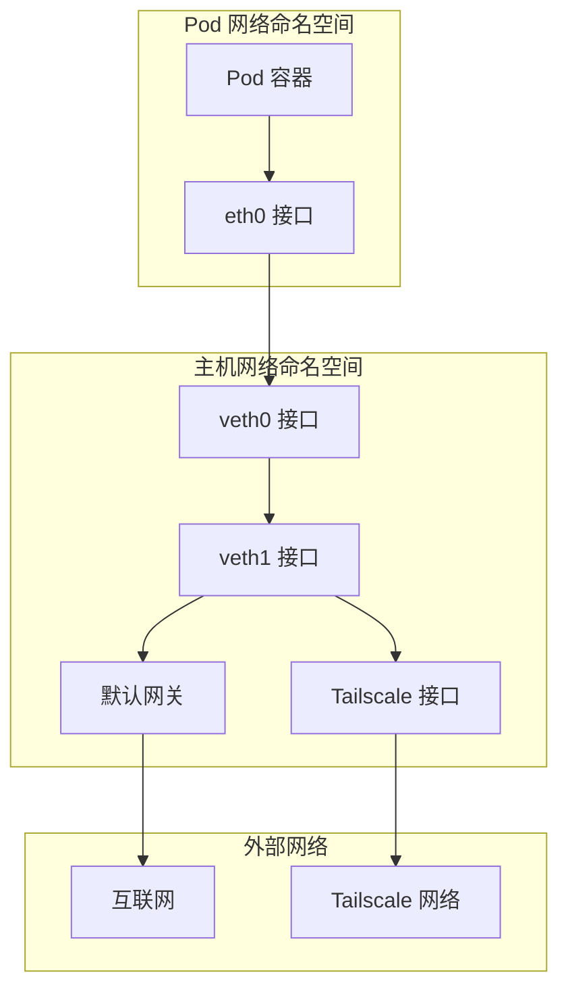
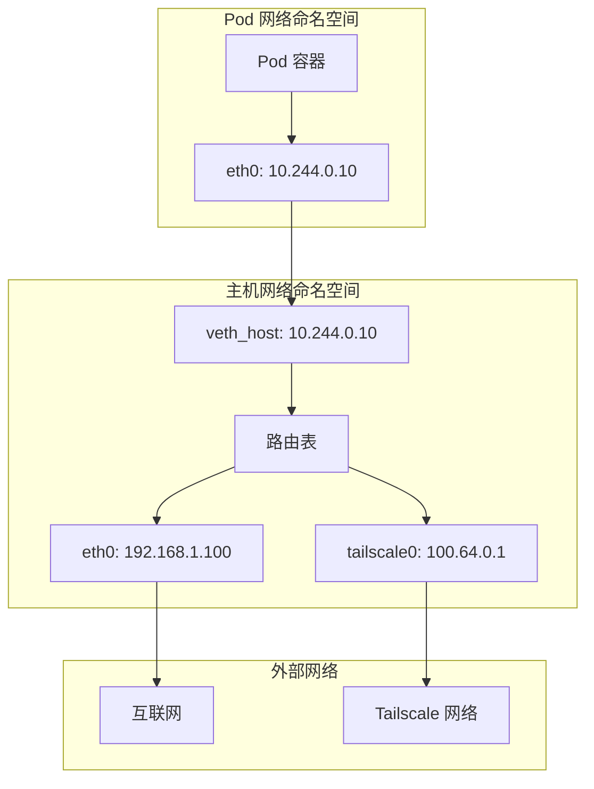
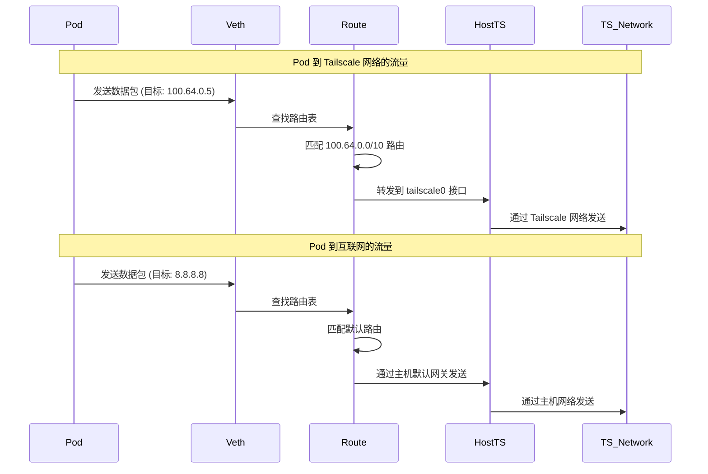
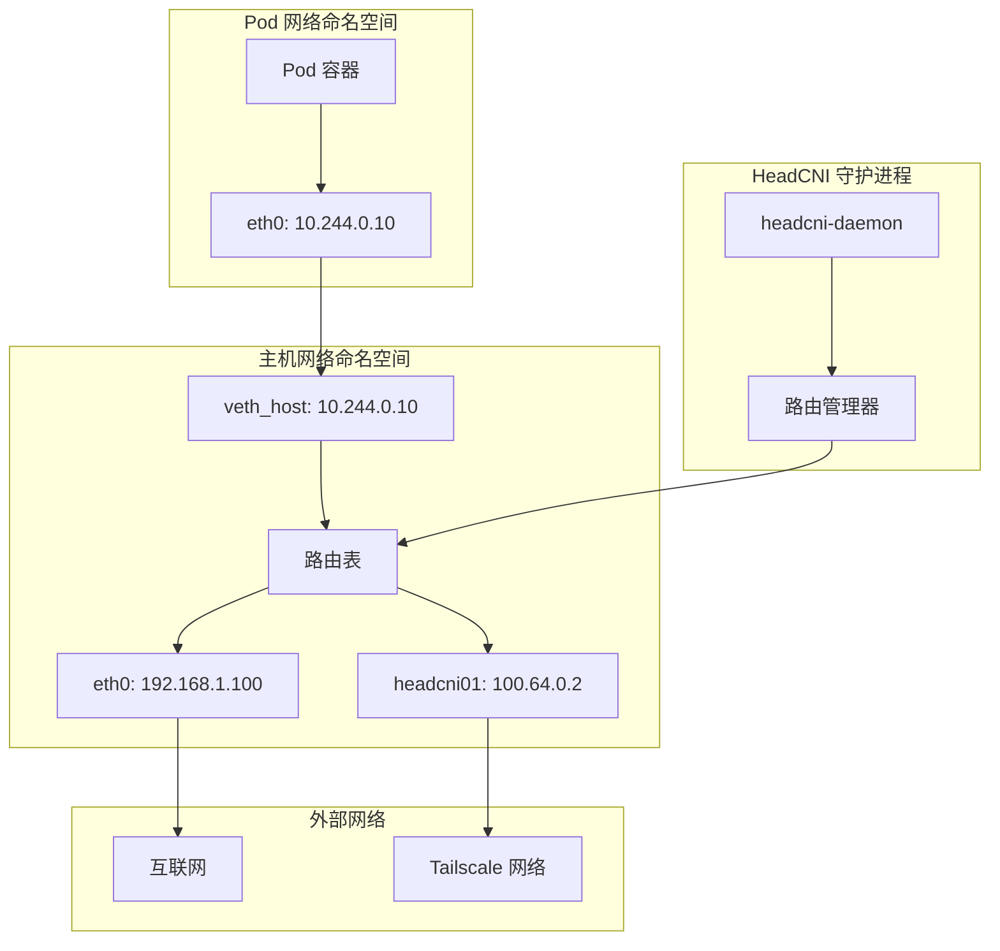
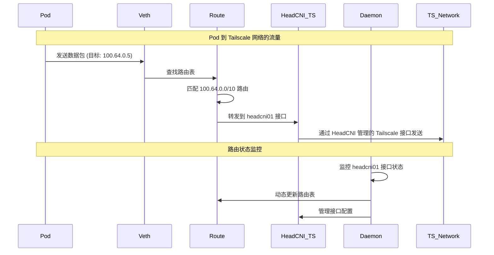
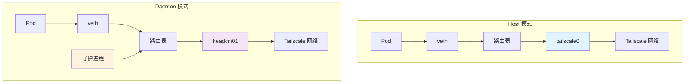

# Pod 网络路由机制详解

## 🔄 Pod 流量路由流程

### 1. **整体路由架构**



## 🏠 Host 模式路由机制

### 1. **Host 模式网络架构**



### 2. **Host 模式路由表配置**

```bash
# 主机路由表配置
ip route show

# 默认路由
default via 192.168.1.1 dev eth0

# Pod 网络路由
10.244.0.0/24 dev veth_host proto kernel scope link src 10.244.0.1

# Tailscale 路由
100.64.0.0/10 dev tailscale0 scope link

# 特定 Pod 路由 (由 HeadCNI 添加)
10.244.0.10 dev veth_host scope link
```

### 3. **Host 模式流量路径**



## 🔧 Daemon 模式路由机制

### 1. **Daemon 模式网络架构**



### 2. **Daemon 模式路由表配置**

```bash
# Daemon 模式路由表配置
ip route show

# 默认路由
default via 192.168.1.1 dev eth0

# Pod 网络路由
10.244.0.0/24 dev veth_host proto kernel scope link src 10.244.0.1

# HeadCNI Tailscale 路由
100.64.0.0/10 dev headcni01 scope link

# 特定 Pod 路由 (由 HeadCNI 动态管理)
10.244.0.10 dev veth_host scope link
```

### 3. **Daemon 模式流量路径**



## 🔍 详细路由配置

### 1. **CNI 插件路由设置**

```go
// HeadCNI 插件中的路由配置
func (p *CNIPlugin) setupPodNetwork(args *skel.CmdArgs, allocation *ipam.Allocation) error {
    // 1. 创建 veth 对
    err := p.networkMgr.CreateVethPair(args.Netns, args.IfName, hostIfName)
    
    // 2. 配置 Pod 端接口
    err = p.configurePodInterface(args.Netns, args.IfName, allocation)
    
    // 3. 配置主机端接口
    err = p.configureHostInterface(hostIfName, allocation)
    
    // 4. 添加路由规则
    err = p.addRoutes(hostIfName, allocation)
    
    return nil
}

// 添加路由规则
func (p *CNIPlugin) addRoutes(hostIfName string, allocation *ipam.Allocation) error {
    // Pod 到网关的路由
    route := &netlink.Route{
        Dst:       &net.IPNet{IP: net.ParseIP("0.0.0.0"), Mask: net.CIDRMask(0, 32)},
        Gw:        allocation.Gateway,
        LinkIndex: link.Attrs().Index,
    }
    
    // 根据模式添加不同的路由
    if p.config.Mode == "host" {
        // Host 模式：使用现有 Tailscale 接口
        err = p.addHostModeRoutes(route)
    } else {
        // Daemon 模式：使用 HeadCNI 管理的接口
        err = p.addDaemonModeRoutes(route)
    }
    
    return nil
}
```

### 2. **Host 模式路由配置**

```go
// Host 模式路由配置
func (p *CNIPlugin) addHostModeRoutes(route *netlink.Route) error {
    // 1. 添加默认路由到主机网关
    err := netlink.RouteAdd(route)
    
    // 2. 添加 Tailscale 网络路由
    tsRoute := &netlink.Route{
        Dst: &net.IPNet{
            IP:   net.ParseIP("100.64.0.0"),
            Mask: net.CIDRMask(10, 32),
        },
        Gw: net.ParseIP("100.64.0.1"), // 主机 Tailscale IP
    }
    
    return netlink.RouteAdd(tsRoute)
}
```

### 3. **Daemon 模式路由配置**

```go
// Daemon 模式路由配置
func (p *CNIPlugin) addDaemonModeRoutes(route *netlink.Route) error {
    // 1. 添加默认路由到 HeadCNI 管理的接口
    route.Gw = net.ParseIP("100.64.0.2") // HeadCNI Tailscale IP
    err := netlink.RouteAdd(route)
    
    // 2. 通知守护进程管理路由
    event := &PodNetworkEvent{
        Type:      "pod_created",
        PodIP:     allocation.IP.String(),
        Gateway:   route.Gw.String(),
        Interface: "headcni01",
    }
    
    return p.notifyDaemon(event)
}
```

## 🔧 守护进程路由管理

### 1. **路由管理器**

```go
// 守护进程中的路由管理器
type RouteManager struct {
    config     *Config
    routes     map[string]*RouteInfo
    interfaces map[string]*InterfaceInfo
    mutex      sync.RWMutex
}

// 路由信息
type RouteInfo struct {
    PodIP      string
    Gateway    string
    Interface  string
    CreatedAt  time.Time
    LastSeen   time.Time
}

// 接口信息
type InterfaceInfo struct {
    Name       string
    IP         string
    Status     string
    CreatedAt  time.Time
}
```

### 2. **动态路由管理**

```go
// 动态路由管理
func (rm *RouteManager) manageRoutes(ctx context.Context) {
    ticker := time.NewTicker(30 * time.Second)
    defer ticker.Stop()
    
    for {
        select {
        case <-ctx.Done():
            return
        case <-ticker.C:
            rm.updateRoutes()
        }
    }
}

// 更新路由
func (rm *RouteManager) updateRoutes() error {
    rm.mutex.Lock()
    defer rm.mutex.Unlock()
    
    // 1. 检查 HeadCNI 接口状态
    if err := rm.checkHeadCNIInterface(); err != nil {
        return rm.handleInterfaceFailure(err)
    }
    
    // 2. 更新路由表
    for podIP, route := range rm.routes {
        if err := rm.ensureRoute(podIP, route); err != nil {
            rm.logger.Error("Failed to ensure route", "pod_ip", podIP, "error", err)
        }
    }
    
    // 3. 清理过期路由
    rm.cleanupExpiredRoutes()
    
    return nil
}
```

## 📊 流量路径对比

### **Host 模式 vs Daemon 模式**

| 特性 | Host 模式 | Daemon 模式 |
|------|-----------|-------------|
| **Tailscale 接口** | 使用现有 `tailscale0` | 创建专用 `headcni01` |
| **路由管理** | 静态路由配置 | 动态路由管理 |
| **接口控制** | 依赖主机 Tailscale | 完全控制 |
| **故障恢复** | 依赖主机进程 | 自动恢复 |
| **网络隔离** | 共享主机网络 | 独立网络空间 |
| **性能** | 较低开销 | 较高开销 |

### **流量路径对比图**



## 🔍 调试和监控

### 1. **查看路由表**

```bash
# 查看主机路由表
ip route show

# 查看特定接口路由
ip route show dev veth_host
ip route show dev tailscale0
ip route show dev headcni01

# 查看路由详细信息
ip route show table all
```

### 2. **查看网络接口**

```bash
# 查看网络接口
ip link show

# 查看接口 IP 配置
ip addr show

# 查看接口统计
ip -s link show
```

### 3. **测试连通性**

```bash
# 从 Pod 测试到 Tailscale 网络
kubectl exec -it <pod-name> -- ping 100.64.0.5

# 从 Pod 测试到互联网
kubectl exec -it <pod-name> -- ping 8.8.8.8

# 查看 Pod 路由表
kubectl exec -it <pod-name> -- ip route show
```

### 4. **监控流量**

```bash
# 监控 veth 接口流量
tcpdump -i veth_host -n

# 监控 Tailscale 接口流量
tcpdump -i tailscale0 -n
tcpdump -i headcni01 -n

# 查看连接状态
ss -tuln
```

## 🎯 关键要点总结

### **路由决策机制**
1. **目标 IP 匹配**: 根据目标 IP 地址匹配路由表
2. **最长前缀匹配**: 选择最具体的路由规则
3. **接口选择**: 根据路由规则选择出口接口
4. **网关转发**: 通过网关转发到目标网络

### **Host 模式特点**
- 使用现有的 `tailscale0` 接口
- 静态路由配置
- 依赖主机 Tailscale 进程
- 较低的资源开销

### **Daemon 模式特点**
- 创建专用的 `headcni01` 接口
- 动态路由管理
- 完全控制网络配置
- 更好的故障恢复能力

### **流量路径**
1. **Pod 发送数据包** → veth 接口
2. **路由表查找** → 匹配目标网络
3. **接口选择** → tailscale0 或 headcni01
4. **网络转发** → Tailscale 网络或互联网 