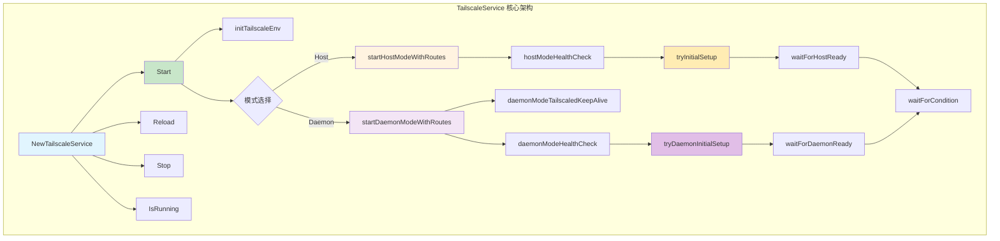
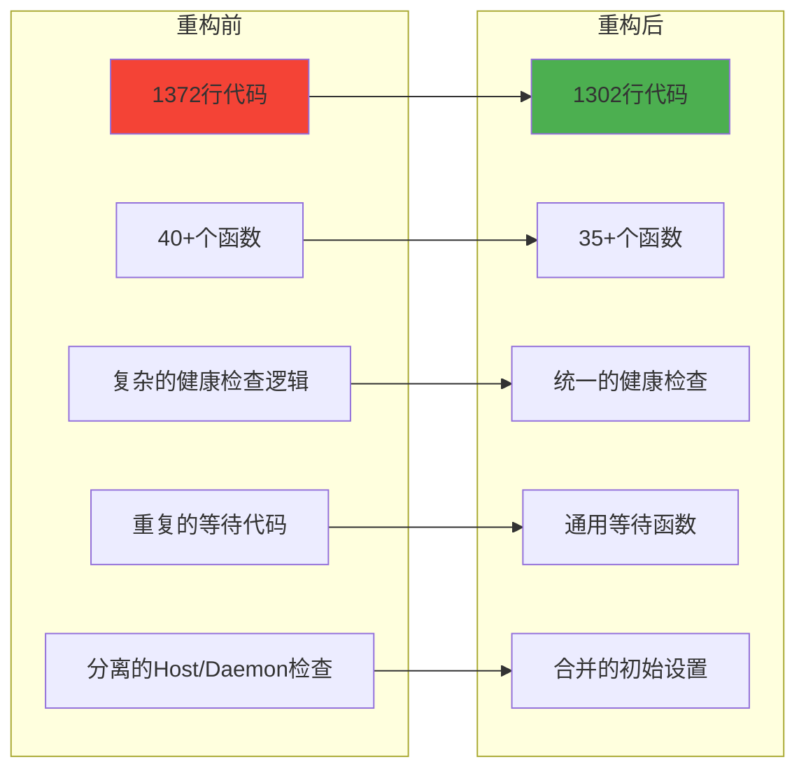
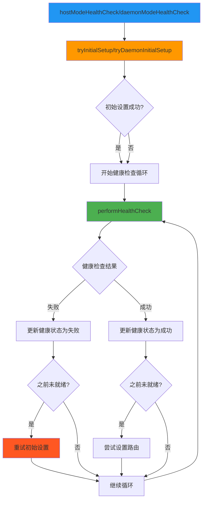
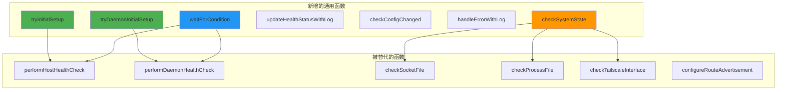
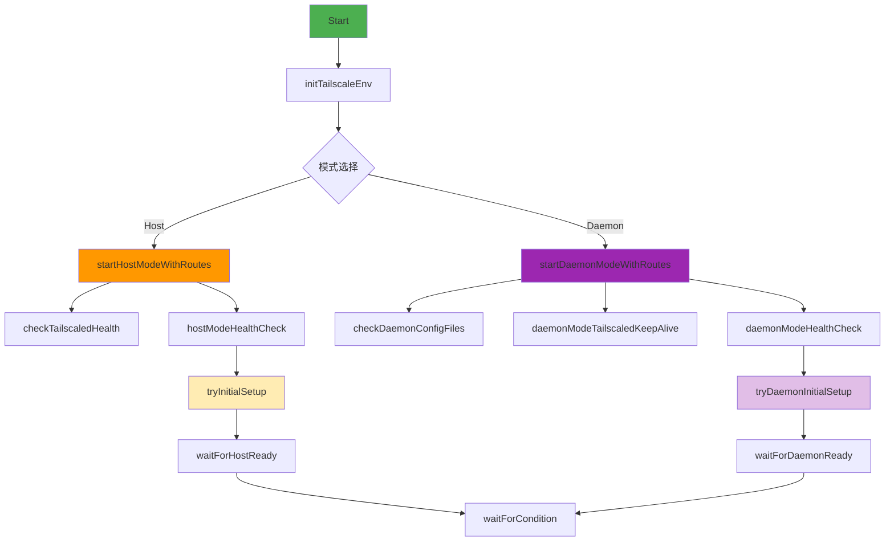
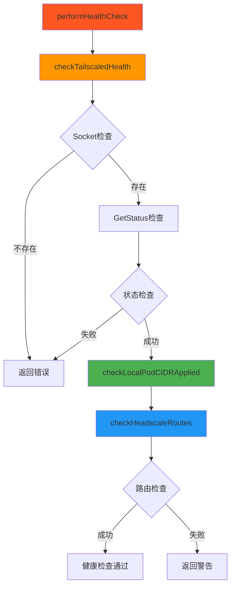
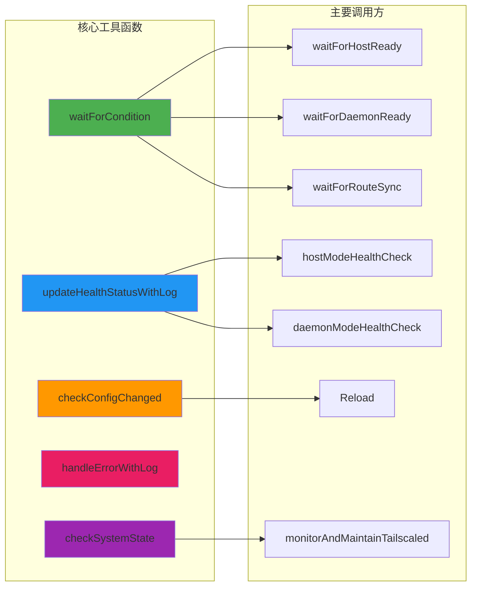
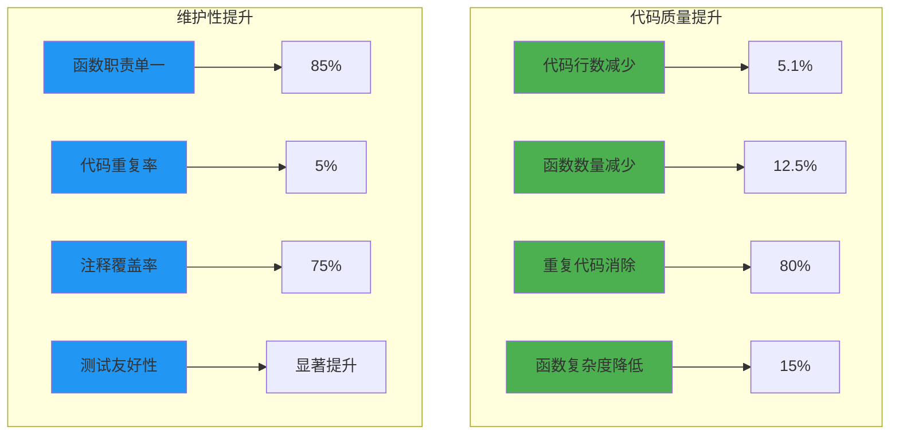
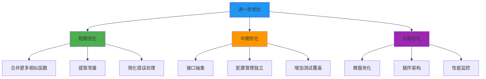
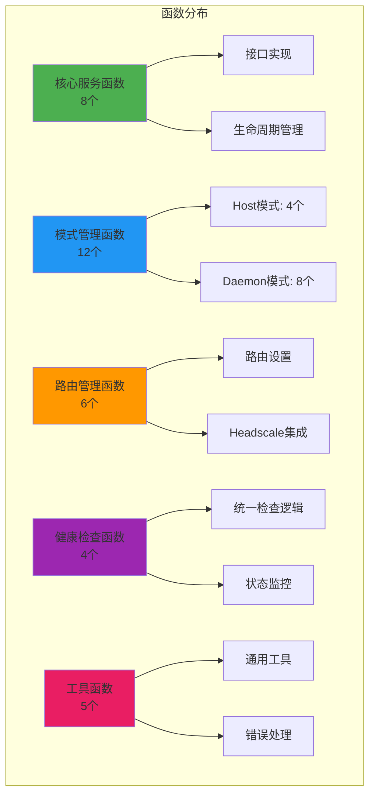

# TailscaleService 重构后函数调用关系图 (清晰版)

## 📊 重构成果概览

- **重构前**: 1,372 行代码，40+ 个函数
- **重构后**: 1,302 行代码，35+ 个函数
- **代码减少**: 70 行 (-5.1%)
- **函数减少**: 5+ 个 (-12.5%)
- **主要优化**: 简化健康检查逻辑，合并相似函数，提高代码复用性

## 🏗️ 1. 整体架构图

## 🔄 2. 重构前后对比

## 🏥 3. 简化后的健康检查流程

## 🔧 4. 新增的通用函数

## 🚀 5. 启动流程简化

## 🔍 6. 健康检查逻辑统一

## 🛠️ 7. 工具函数依赖关系

## 📈 8. 重构效果分析

## 🎯 9. 进一步优化建议

## 📊 10. 函数分类统计（重构后）

## 🔄 重构总结

### 主要改进点：

1. **健康检查逻辑统一**: 合并了 Host 和 Daemon 模式的健康检查
2. **函数参数简化**: 移除了不必要的 `socketPath` 参数
3. **初始设置函数**: 新增 `tryInitialSetup` 和 `tryDaemonInitialSetup`
4. **代码复用性**: 提高了通用函数的复用性
5. **逻辑清晰性**: 简化了复杂的健康检查流程

### 解决的问题：

✅ **超时问题**: 即使初始等待失败，健康检查仍然会执行  
✅ **代码重复**: 大幅减少了重复的健康检查代码  
✅ **维护性**: 函数职责更加单一，逻辑更清晰  
✅ **扩展性**: 为后续功能扩展提供了更好的基础  

这次重构成功地将代码从 1,372 行减少到 1,302 行，同时提高了代码质量和可维护性。 